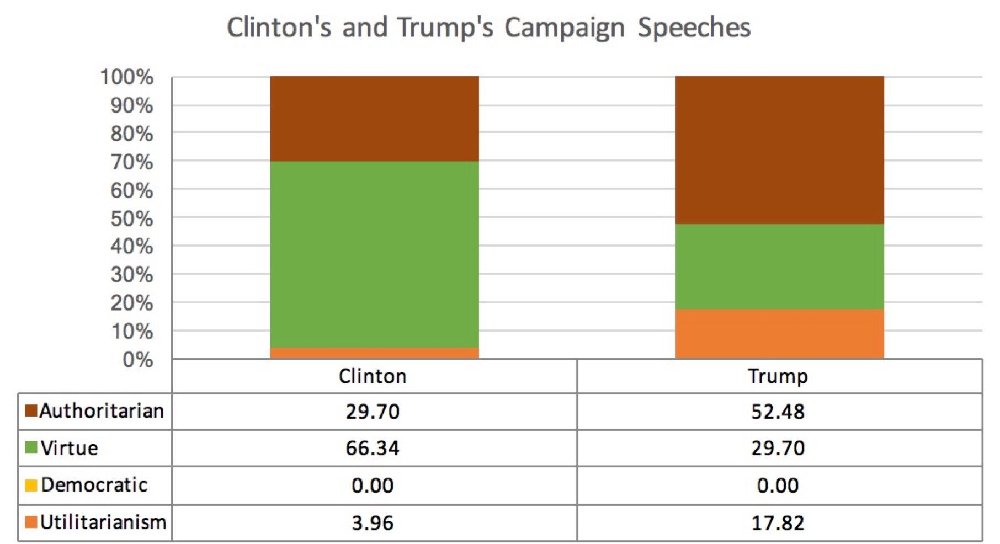

# Philosofier
Paper Title: "Analyzing chronological changes in philosophical and religious inclination from text"  
Adviser: [Prof. Christiane Fellbaum](https://www.cs.princeton.edu/~fellbaum/)

An NLP machine learning project submitted for Princeton's CS Junior Independent Work. Classifies textual documents based on their philosophical and religion inclination.

**A winner of "Best Poster Award" for Princeton CS Department's Junior Independent Work.**  

### Motivation
- As a reflection of the recent election…
- Use categories other than liberal/conservative views to detect:
  - Philosophical inclinations (Utilitarianism, Virtue Ethics, etc.)
  - Religious views (Christianity, Buddhism, Islam, etc.)
  - Political Ideology (Socialism, Anarchism, Authoritarianism, etc.)
- Observe how religious and philosophical inclinations have changed over time

### Training Sets Examples:
- Religion:
  - Christianity: The Gospel of Luke
  - Buddhism: Buddhist Scriptures
  - Islam: The Quran
  - Hinduism: Vedanta Sutras
  - Non-religious/Atheism: Beyond Good and Evil (Nietzsche)
- Philosophy:
  - Democratic Ideals: The Declaration of Independence, Second Treatise of Government (Locke)
  - Virtue Ethics: Nicomachean Ethics (Aristotle), Ethics (Spinoza)
  - Authoritarian: Leviathan (Hobbes), The Prince (Machiavelli)

### Sample data used:
- State of the Union Addresses
- Democratic and Republican Parties' Presidential Nomination Speeches
- 2016 Presidential Candidates Hillary Clinton and Donald Trump's Campaign Speeches

### Result?

Surprise, surprise.
